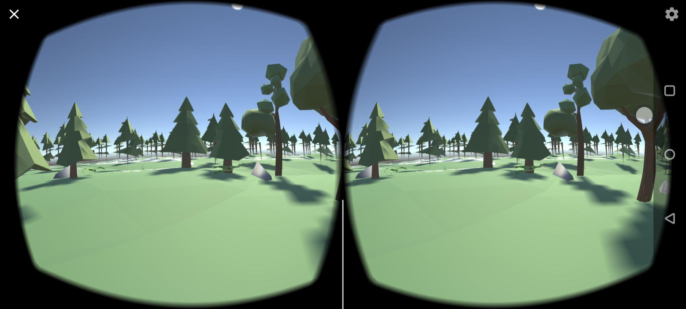
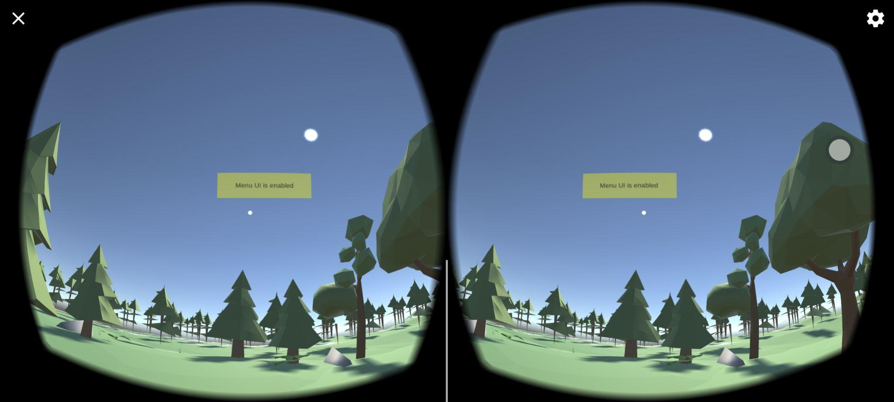
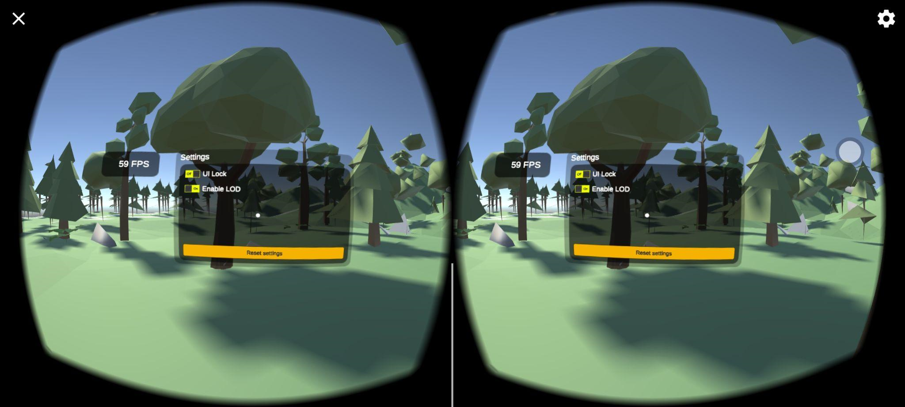
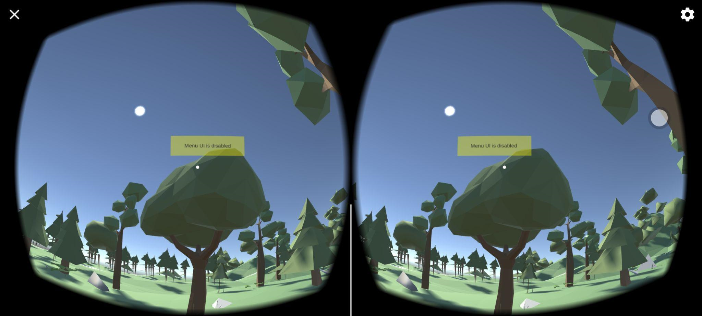
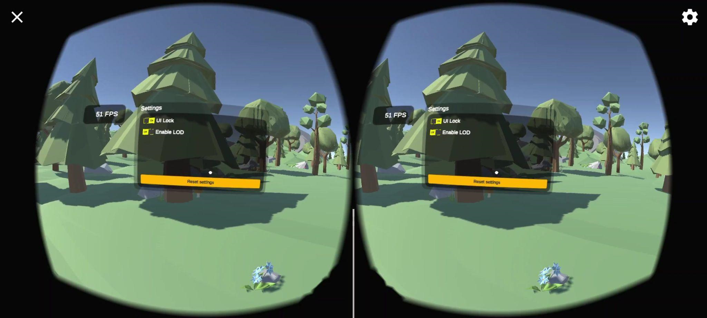
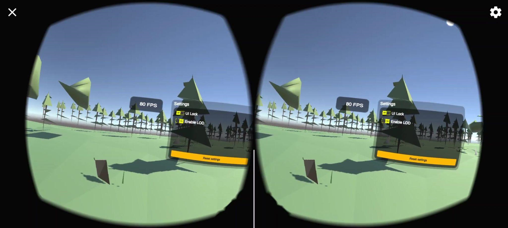

# Android-VR-LOD-Performance-Testing
### LOD stands for Level of Details. We may see a lot of games implement this is graphical setting to reduce the CPU and GPU usage or consumption by reducing the number of polygons of the rendering objects in a game. This project is an Android VR application to test the effect of LOD on 6 different phones. Proceed to read this readme to see the testing result and the introduction to the application.

### How to run the application.
Download the apk and install it on your Android phone. 
Minimum Android requirement is 7.0 (Nougat)

#### This is the interface when user runs the application.

#### Head-up the phone and hold for 2 seconds to enable the setting Menu.

#### User is able to choose on/off LOD setting, see the FPS info, lock the FPS UI on on the screen and reset the settong to default (LOD on, UI lock off).

#### Head-up and hold for another 2 seconds to turn off the menu.

#### The FPS value when LOD is turned off.

#### The FPS value when LOD is turned on.

#### The result of experiment on 6 different Android phones.

#### The percentage of difference before LOD on and off for 6 Andorid phones.

